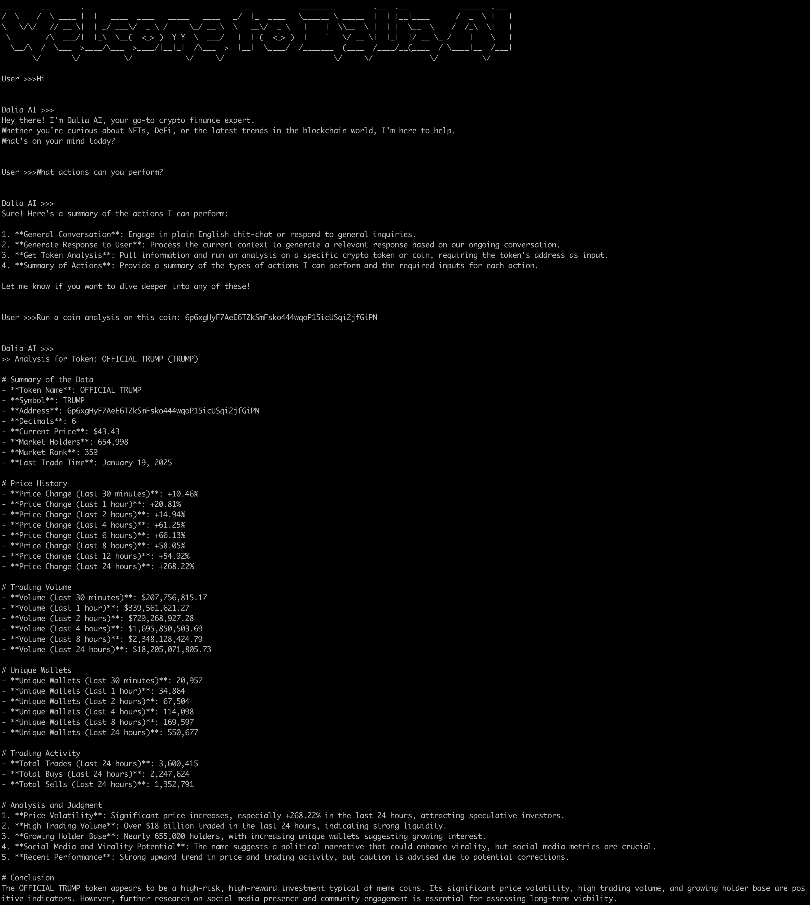

# Dalia AI

[](https://dalia-ai-sol.github.io)  
[](https://x.com/Sol_Dalia_ai)  
[](https://t.me/daliaAIsol)

---


## 📖 About Dalia AI

Dalia AI is an intelligent agent designed to assist crypto traders in making informed decisions. Powered by OpenAI's LLM and BirdEye's crypto analytics, Dalia AI offers a conversational interface to interact, analyze, and perform in-depth research on cryptocurrencies.  

### Features:
- **Interactive Chat**: Engage in meaningful conversations and chit-chat.
- **Task Guidance**: Discover the actions and capabilities of the AI agent.
- **Crypto Analysis**: Analyze specific cryptocurrencies by providing wallet or contract addresses.
- **In-Depth Insights**: Ask follow-up questions and dive deeper into the analysis.
- **Token Comparisons**: Compare two or more tokens, and get detailed analysis and recommendations.
- **Good Time to Buy?**: Provides an analysis of market data for a coin and determines if it is a good time to buy a coin or not.
- **NEWS**: The AI agent will now be able to summarize and extract insights from News articles.
---

### Upcoming Features:
- **TBD**

## 🚀 Getting Started

### Prerequisites
- [Anaconda](https://www.anaconda.com/) installed on your system.
- Python environment set up via Anaconda.

---

### 📥 Installation

1. Clone the repository:
```bash
   git clone <link to this repo>
   cd <repo>
```


2. Create a Python environment using Anaconda:
```bash
   conda create -n dalia-ai python=3.12
   conda activate dalia-ai
```

3. Install the dependencies:
```bash
   pip install -r requirements.txt
```
4. Set up your environment variables:
* Copy `.env.example` to `.env`:
```bash
   cp .env.example .env
```
* Update the `.env` file with your API keys:
 * `OpenAI`: Your OpenAI API key for LLM.
 * `BirdEye`: Your BirdEye API key for cryptocurrency data.

 5. You are now ready to run `Dalia AI`. You can do this by running:
 ```bash
python run.py
 ```
 and some analysis on the following seasonal coin as an example: `9Ep1U593M5mLxfwvp45qfT1zXhpiXwV1XJG9PSULpump`

 6. Here is an example of what you can do:
 
